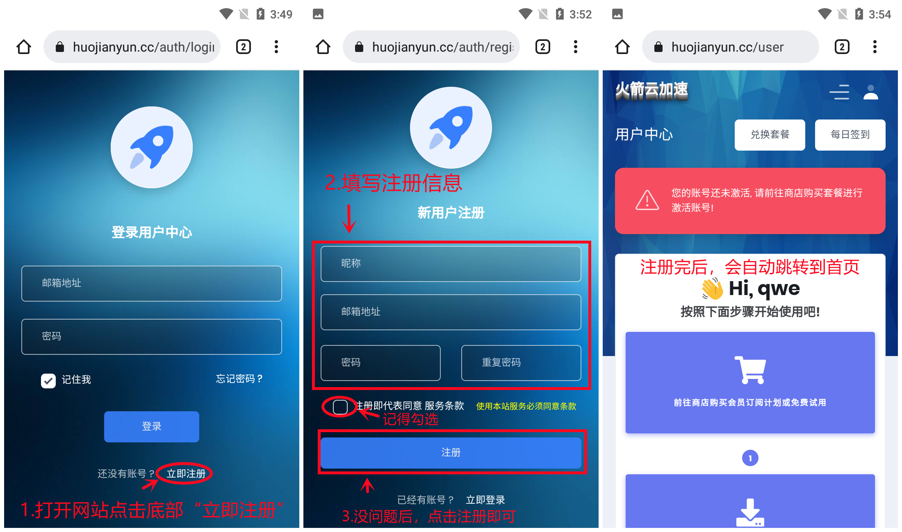
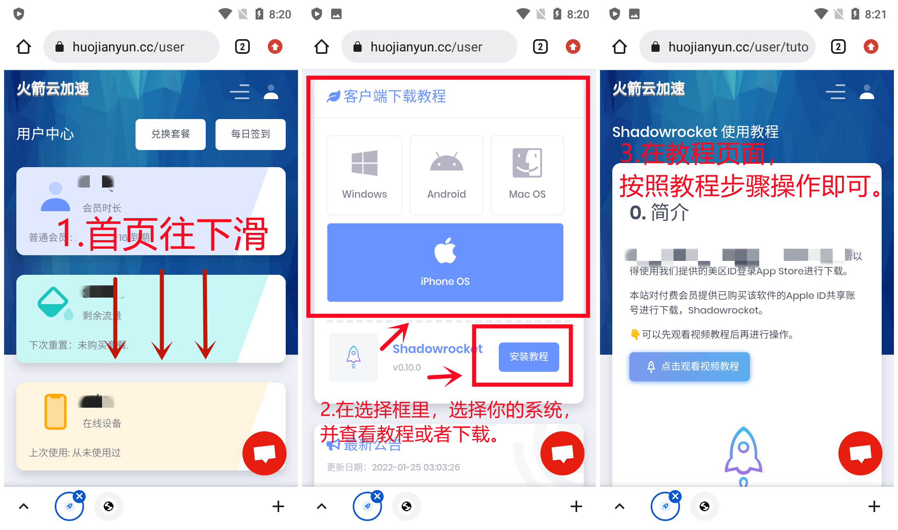
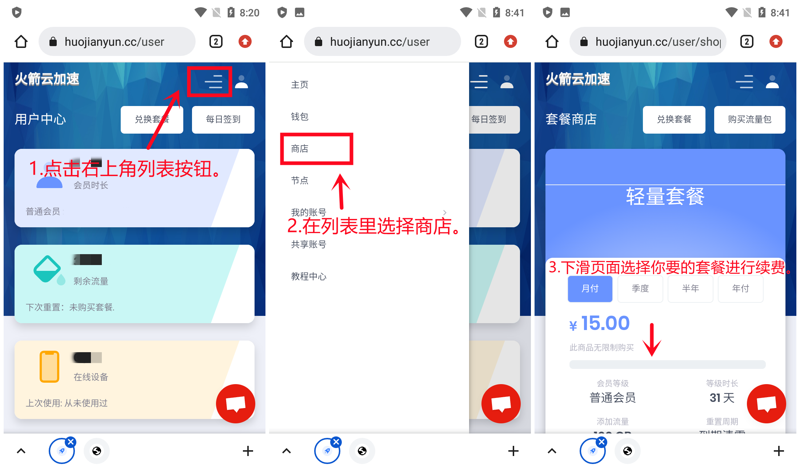

# 使用说明

<mark style="color:red;">使用ChatGPT选台湾,美国,英国。如使用不了可开全局模式试试（Mac系统除外）。</mark>

<mark style="color:red;">IOS开全局：软件首页-全局路由-选择-代理</mark>

有问题联系网站右下角客服

#### 网站地址👇（建议收藏）

[点我进入网站](https://jiasu.pw/)

👇保姆级教程，老司机可跳过。

### 怎么注册账号？ 

1.上面网站上用浏览器打开。

2.点击网站登录页，底部的“立即注册”。

3.填写注册信息，并勾选“同意服务条款”。

4.没问题后，点击“注册”按钮，会自动跳转到网站首页。

<figure><figcaption></figcaption></figure>

### 怎么兑换套餐？ 

1.点击网站首页或者商店页面右上方的“兑换套餐”按钮。

2.把套餐码（套餐码在TB提取），复制并粘贴到兑换套餐输入框。

3.点击“立即兑换”，提示兑换成功后，点击“ok”即可。

<figure><figcaption></figcaption></figure>

### 怎么使用，在哪里下载软件？ 

在网站首页“客户端下载教程”框里选择系统，下载软件（如下图👇）。

<mark style="color:red;">**任选一个软件查看教程安装哈，不是全部安装**</mark>

<figure><figcaption></figcaption></figure>

上面就是首次兑换教程，网站上选择你的系统，在网站上查看教程。

### 会员到期了，怎么续费？（这个是后期续费教程） 

1.登录网站，首页上面“商店”，里面可以选择套餐扫码支付续费。

<figure><figcaption></figcaption></figure>


遇到问题联系官网右下角客服

